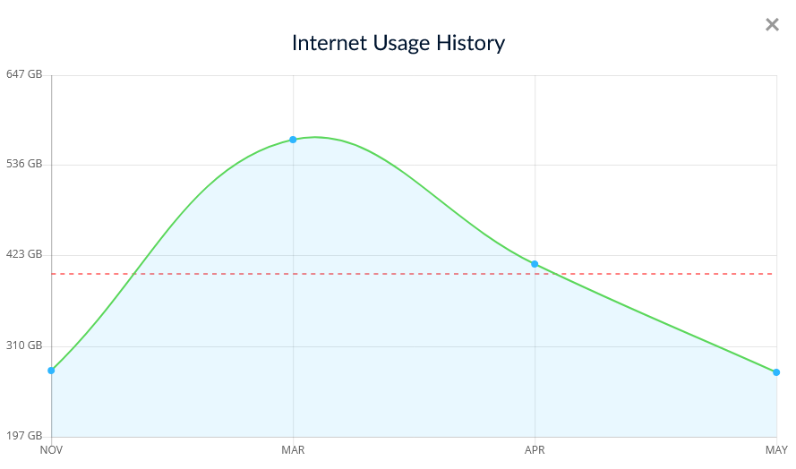
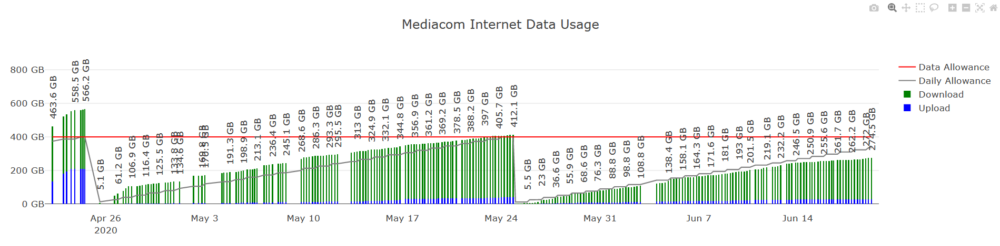

This project is no longer actively supported since I'm not a Mediacom customer anymore.

MediacomInternetDataUsageMonitorAndAlert
========================================
Monitor your Mediacom internet data usage and receive alerts when exessive usage occurs.  A website allows you to view historical data as well.

What Mediacom shows:

What this MediacomInternetDataUsageMonitorAndAlert program shows:

cron-monitor.py
---------------
Python script to be run via cron.  The scripts gets the current data usage and stores it in the database.  See "User Configuration" in the script file for the required configuration.

server.py
---------
Python script (Dash/Flask app) of the web interface to view the historical usage data in the database.  
It can be run directly with python but it's best to deploy it to a WSGI server.

I used these instructions successfully to deploy the the app on a Raspberry Pi 3:
https://www.raspberrypi-spy.co.uk/2018/12/running-flask-under-nginx-raspberry-pi/

MediacomUsage.db
----------------
SQLite database that stores the internet usage data.
